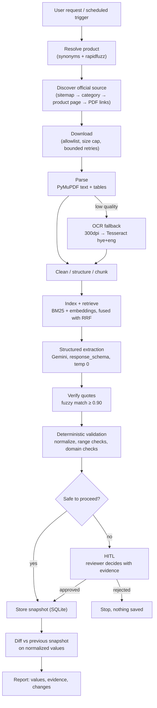

# Architecture

How the ACBA tariff monitoring agent is put together: the modules, the order they
run in, and the decisions behind them.

> **Current state: Phase 5 of 9.** A fuzzy product name resolves to a product, to its
> official ACBA sources, and those sources are parsed into clean pages, tables and sections
> and then indexed — so the system answers, per tariff field, *which passages state this, and
> is any of them actually relevant?* Extraction, validation, snapshots, change detection, HITL
> and the ADK agent are not built. Sections marked *(Phase N)* name the phase that built them;
> anything describing a later phase is written in the future tense.

---

## 1. The idea in one paragraph

A **tariff** is the bank's published price list for a product: currency, term, amount,
nominal rate, effective rate, collateral, fees, salary privileges. ACBA publishes these
in official documents («տեղեկատվական ամփոփագիր») and on product pages. This agent takes a
fuzzy product name in Armenian, English or Russian, finds the official source, extracts
those ten fields **with a quote and page for each**, validates them with plain Python,
stores a snapshot, compares it with the previous one, and reports what changed — handing
the decision to a human whenever it cannot decide safely.

## 2. End-to-end flow



**What Gemini will decide (Phase 6):** which retrieved chunk answers a given tariff field,
and what text to quote as the evidence for it. That is the whole of it.

**What code decides — never the model:** which product the user meant (deterministic
synonyms + fuzzy matching, [P3-D1](DECISIONS.md#p3-d1--product-resolution-is-deterministic--no-gemini)),
which domains may be fetched, whether a redirect may be followed, whether a download is
allowed by size and type, which source is authoritative, whether a quoted value really
appears in the document, whether a value is well-formed, what counts as a meaningful
change, and whether a human is needed.

## 3. Module map

```
config/                        version-controlled policy, readable without opening Python
  allowlist.yaml               the only fetchable hosts: acba.am, www.acba.am, https only
  products.yaml                the two products: synonyms, canonical page, exclusions, seeds
  discovery.yaml               source-ranking weights, including the negative ones
src/tariff_agent/
  fields.py                    the tariff field registry — the spine of the project
  models.py                    Evidence / FieldValue / TariffExtraction + their invariants
  config.py                    env settings (SecretStr key) + typed YAML loaders
  errors.py                    one exception per failure mode
  http/
    url_policy.py              may this URL be fetched? — pure functions, no I/O
    client.py                  SafeHttpClient: caps, manual redirects, revalidating cache
    robots.py                  per-host robots.txt, fetched through the same client
  discovery/
    product_matcher.py         fuzzy product name -> product id, or a reviewer decision
    sitemap.py                 defusedxml sitemap parsing, degrading to [] on failure
    sources.py                 ranking pages and PDFs into primary + supporting sources
  documents/
    document.py                Document / Page / Table / Section contracts
    pdf.py                     two PyMuPDF readings of every page
    ocr.py                     300 dpi render + Tesseract, capped
    strategies.py              which reading of a page wins, and why
    quality.py                 0-1 text score with named fatal defects
    cleaning.py                Armenian-aware cleaning rules, one per function
    tables.py                  table extraction, and refusing what is not a table
    sections.py                heading detection from text shape
    html.py                    a product page as a first-class document
    processing.py              the façade: bytes -> Document
  rag/
    text.py                    Armenian stemming, «և» folding, tokenization
    chunking.py                page- and section-aware chunks with exact offsets
    bm25.py                    lexical index + document frequency
    embeddings.py              Gemini embeddings, or an honest absence
    index.py                   per-document index keyed by content hash
    retrieval.py               weighted RRF fusion and the relevance gate
    knowledge.py               the façade: documents -> retriever
  observability/logging.py     single-line JSON logs with a per-run correlation id
tests/
  test_phase1_contracts.py     52 tests: registry, config, invariants, migration, run logs
  test_url_policy.py           19 tests: lookalike hosts, schemes, encoding, relative links
  test_http_client.py          30 tests: retries, caps, redirects, revalidation, pacing
  test_robots.py                6 tests: allow / disallow / 5xx stops the run
  test_product_matcher.py      31 tests: hy/en/ru, typos, ambiguity, unsupported products
  test_discovery_sources.py    34 tests: scoring, primary selection, budgets, HITL, sitemaps
  test_document_cleaning.py    16 tests: each cleaning rule alone
  test_document_quality.py      7 tests: every extraction failure mode
  test_document_processing.py  28 tests: strategies, PDF, HTML, tables, OCR
  test_rag_text.py             13 tests: stemming, folding, the identifying-token rule
  test_rag_chunking.py         10 tests: page boundaries, offsets, tables, metadata
  test_rag_retrieval.py        19 tests: fusion, the gate, index reuse, degradation
  fixtures/                    trimmed REAL ACBA pages + synthetic PDFs reproducing defects
data/samples/ocr/              a real ACBA page rendered to an image, for the OCR test
```

Dependencies run one way, with no cycles:

```
fields.py ─┐                         errors.py ─┐
           ├─► models.py                        ├─► config.py ─┐
logging.py ┘                         logging.py ┘              │
                                                               ▼
                                              http/url_policy.py ─► http/client.py
                                                                         ▲   │
                                                          http/robots.py ┘   │
                                                                             ▼
                                        discovery/{product_matcher, sitemap, sources}.py
                                                                             │
                                                                             ▼
                                        documents/* ─────────────► rag/* ────► (Phase 6)
```

The two modules everything imports — `fields.py` and `errors.py` — depend on nothing
themselves, so they cannot break from a change elsewhere. `robots.py` needs the client and
the client needs a robots check, so the client depends on a two-line `Protocol` rather than
on the module that imports it.

### `fields.py` — the registry

Ten `FieldSpec` entries, each carrying everything the rest of the system needs to know
about that field:

| attribute | used by | what it does there |
|---|---|---|
| `id` | Phases 6–7 | key in the Gemini schema, the snapshot and the diff — never change it once snapshots exist |
| `label_hy` / `label_en` | report | what the business user reads |
| `kind` | Phase 6 | picks the normalizer: `"13,5 %"` → `{"value": 13.5, "unit": "percent"}` |
| `kind` | Phase 7 | picks the change magnitude rule: **percentage points** for rates, **relative %** for amounts |
| `required` | Phase 6 | a missing required field lowers the completeness score |
| `query_terms` | Phase 5 | the actual per-field retrieval queries, Armenian first |

Adding an eleventh tariff field is one entry here and nothing else. That property is the
justification for the module. Known limitation: `ValueKind` is coarse — `FEE` has to cover
`"0.5%"`, `"5,000 AMD"` and `"անվճար"`.

### `models.py` — the contracts, and the anti-hallucination rule

- **`Evidence`** — `document_name`, `source_url`, `page`, `section`, `quote`. Enough for a
  human to reopen the document and check the number. `page` is optional because HTML
  product pages have no pagination and are first-class sources here.
- **`FieldValue`** — `value` (verbatim from the document, or the `NOT_FOUND` sentinel),
  `normalized`, `evidence`, `status`, `confidence`.
  - `value` stays **verbatim** so the report shows what the bank actually wrote;
    `normalized` is the canonical form the diff compares, which is why
    `"10 000 000 AMD"` and `"10,000,000 AMD"` raise no false alert.
  - `NOT_FOUND` is a **string sentinel, not `None`**, so absence survives the trip through
    JSON, SQLite and the report, and cannot be confused with "not looked at yet".
  - `confidence` is `None` until Phase 6 computes it from the quote-match score, the
    document quality score and the retrieval score. It is **never** the model's own
    self-reported number — the Gemini response schema does not contain this field.
  - The validator enforces three rules: value and status must agree; a `NOT_FOUND` field
    carries no evidence or normalization; **a field holding a real value must have
    evidence**. The last one means a value that cannot cite a source cannot be
    constructed at all — hallucination is blocked structurally, not by prompt wording.
- **`FieldStatus`** — `found`, `not_found`, `unverified` (the quote could not be matched
  back to its chunk, or a check failed), `conflict` (two official sources disagree).
  Per-field trouble lives here; whether the *run* stops for a human is a separate,
  run-level decision carried by `NeedsReviewError`.
- **`TariffExtraction`** — one product, one run. The constructor requires **exactly** the
  registry's field ids: a dropped field is indistinguishable from a field the bank does
  not offer, and the report must tell those apart. The model cannot add fields of its own.
- **`TariffExtraction.from_stored()`** — the one lenient path. A snapshot written before a
  registry change would otherwise fail to load and crash the diff, so reading from storage
  backfills unknown-to-old fields as `NOT_FOUND`, drops fields no longer in the registry
  (with a log line), and preserves the stored `schema_version` (`0` for snapshots written
  before versioning). Fresh model output still goes through the strict constructor.

### `http/` — the one network door *(Phase 2)*

Everything downstream works on bytes this package has already declared safe. The LLM never
passes a URL in: agent tools take ids produced by earlier tools.

**`url_policy.py`** — pure functions, no I/O: `normalize_url`, `is_allowed_url`,
`assert_allowed`, `filter_allowed`. Exact host membership over https. Suffix matching
(`host.endswith(".acba.am")`) is the classic mistake — it accepts `acba.am.evil.com` — so it
is not used. Kept separate from the client so the rule is testable without HTTP machinery
and cheap to re-apply on every redirect hop.

**`client.py`** — `SafeHttpClient.fetch(url, expect=ContentKind.PDF)` applies, in order:
policy before the socket · separate connect/read timeouts · **manual redirect loop**, at
most 5 hops, allowlist re-checked on each (httpx's automatic redirects would follow a hop
off-domain silently) · streamed size cap on bytes actually received · content type checked
against both the header and the leading magic bytes · bounded exponential backoff with
jitter, only on timeouts, connection errors, 408/425/429/5xx · one JSON log line per fetch.

**Caching is revalidation, not a short-circuit.** A monitor that served cached bytes without
asking would never notice a new edition, so every fetch contacts the server with
`If-None-Match` / `If-Modified-Since` from the sidecar metadata; a `304` reuses the cached
bytes. Only `offline=true` skips the network. The validators are re-attached across a
redirect when — and only when — the target is exactly the `final_url` the cached copy came
from: ACBA permanently redirects `www.acba.am` → `acba.am`, and without this the ETag was
lost on every hop and the 1 MB tariff PDF was re-downloaded on every run.

**`robots.py`** — `RobotsPolicy` per host, fetched **through `SafeHttpClient` itself** (via
`check_robots=False`) so there is exactly one network door with one set of limits. A 4xx
means no rules exist and fetching proceeds; a 5xx or timeout means permission is unknown and
the run stops.

### `discovery/` — deciding what to download *(Phase 3)*

**`product_matcher.py`** — `resolve_product(query, catalog)` is hybrid and fully
deterministic: a curated multilingual synonym dictionary in `config/products.yaml` carries
the *semantics* (no string metric discovers that «հիփոթեք», "mortgage" and "ипотека" are one
product), rapidfuzz `token_set_ratio` absorbs the *typos, word order and extra words*, and an
`unsupported_terms` penalty handles the case similarity gets flat wrong — "business mortgage"
literally contains "mortgage" and scores 100 against it. Bands: ≥85 with a ≥10 lead resolves;
60–85 or a close race is `AMBIGUOUS` and goes to a human; below 60 is `NOT_FOUND`. It returns
a status object rather than raising, because the ambiguous case carries the data a reviewer
needs and Phase 8 tools must hand the model a status, never an exception.

**`sitemap.py`** — parsed with `defusedxml`, not lxml: stock XML parsers expand entities, and
a "billion laughs" document is a few hundred bytes on the wire and gigabytes in memory. Every
failure degrades to `[]`, because the sitemap is one route of three. ACBA's real sitemap
contains a malformed `<loc>`; one bad entry must not discard the other 587.

**`sources.py`** — `discover_product_sources()` returns a **primary source plus supporting
ones**, not a single winner. Two properties of the real site forced that shape:

* *The authoritative source is not always a PDF.* The consumer-loan page links no
  «ամփոփագիր» at all and states its rates inline, while the mortgage page links a proper
  information summary among nine PDFs. A "PDF beats HTML" rule reports the wrong document.
* *Some documents are shared.* `loans-tariffs.pdf` covers every loan product, so it is exempt
  from the product-slug requirement — and, being product-agnostic, it can never be primary.

Ranking is additive and **explainable**: every candidate carries the reasons behind its score
(`anchor mentions 'տեղեկատվական ամփոփագիր' (+50)`), which are logged and shown to a reviewer.
Weights live in `config/discovery.yaml` — Armenian keywords are exactly what a bank-side
reviewer should be able to correct. Negative weights matter as much as positive ones: an
archived tariff PDF and a business-product page are the two ways a plausible-looking document
is the wrong one, and `/business/` vs `/individual/` in the path is a stronger discriminator
than any keyword. Candidates below `min_score` are dropped, not merely ranked last.

Selection order is **role first, then score**: only a candidate carrying a primary signal (an
information summary, or a page that states rates itself) may lead. Supporting sources are then
ranked by score alone, so the shared tariff PDF is not buried beneath sibling pages.

Two refinements the real site forced, both in `products.yaml` rather than in code:

* **A product may pin its `canonical_page`.** ACBA's consumer *category* page lists several
  loans, shows four headline percentages and states no effective rate at all — one honest set
  of ten tariff fields cannot come from it. The monitored product is therefore named exactly:
  the unsecured consumer loan up to 10M AMD, whose own page carries a real rate table. The
  category page stays as a supporting source.
* **A product may name its neighbours in `exclude_terms`.** When two information summaries
  score within 10 points, `requires_review` is set with both candidates — the assignment's
  "two plausible official PDFs" case, produced by the real site rather than staged. But ACBA's
  renovation-mortgage summary would trigger that on *every* run, over a document already known
  to be the wrong product. Escalation that repeats nightly is an alarm nobody reads, so
  «վերանորոգման» is excluded for the mortgage specifically. An unrecognised rival still stops
  the run, which a test pins.

### `documents/` — bytes into quotable text *(Phase 4)*

Every page is read by **every available strategy** and the best is kept, because the real
mortgage summary's text layer is broken four ways — one word per line, glued words, 53 of
1,593 characters, and a dropped digit in an amount — while OCR reads it at 91.9% confidence.
The parse does not *fail* there; it returns plausible text with a digit missing, which is worse.
So OCR is a peer, not a fallback, and `Page.method` records which won.

`quality.py` scores candidates on one scale with **named fatal defects** (`glued_words`,
`one_word_per_line`, `few_letters`, `unreadable_characters`), so a low score is explainable in a
log line. Scoring happens **before** lines are joined: joining first turned one-word-per-line
text into prose and it scored a perfect 1.00.

`cleaning.py` is deliberately timid — only unambiguous thousand groups are rejoined, because
«10 59 10 10» in the real document is a phone number — and never touches table cells, where a
repeated short line is «0%» in another row. `tables.py` refuses what PyMuPDF reports as a table
on a graphics-heavy page (`['ն','և','','']`). `html.py` takes the whole content container after
stripping chrome: an allow-list of tags, and then a "densest container" heuristic, each lost
most of the page.

### `rag/` — which passages state a field *(Phase 5)*

Armenian morphology does most of the work: «տոկոսադրույք» appears in five inflected forms, and
a light stemmer collapses them. Tesseract's «և»→«ն» confusion is folded for matching only —
measured across 26,054 corpus tokens to collide with **no** real word.

Chunks never span a page and carry exact offsets into `Page.text`, so Phase 6 can verify a quote
rather than guess at it. A table is its own chunk with its heading **inside the text**, because
the model sees text and not metadata.

Ranking fuses BM25 and embeddings by rank (RRF), weighted: query phrasings canonical-first, and
a third ranking that promotes chunks which mention the field **and** contain a value of its
declared `ValueKind` — without which BM25 ranked a marketing banner above the rate table it
advertises.

**The relevance gate is lexical, by measurement.** On the consumer page the maximum cosine for
an application fee it never mentions was 0.687, while «Արժույթ», stated plainly, reached 0.682.
No floor separates them, so embeddings rank and only a lexical hit — requiring the term's
*identifying* token — decides that an answer exists.

Primary and supporting sources are searched separately, because the bank's documents disagree
(the 2023 summary says 11.9–12.5% where the current page says 13.75–14.5%) and Phase 6 needs to
see that as a conflict rather than average over it.

### `config.py` — split by who needs to audit it

- **Secrets → environment.** `Settings` (pydantic-settings) reads `.env`. App variables use
  the `TARIFF_` prefix; `GOOGLE_API_KEY` and `GOOGLE_GENAI_USE_VERTEXAI` stay unprefixed
  because the google-genai SDK reads those exact names itself. The key is a `SecretStr`, so
  it is masked in reprs, logs and tracebacks. `has_api_key` lets offline demos and tests
  take the mock path instead of failing.
- **Policy → committed YAML.** `Allowlist` and `ProductCatalog` are frozen models parsed
  from `config/*.yaml`, so a reviewer sees the project's whole network surface in six lines
  and product changes show up in a diff. `Allowlist` is data only — matching logic belongs
  to the Phase 2 URL policy, which must run on **every redirect hop**.
- A missing or malformed file raises `ConfigError` naming the file at startup, rather than
  misbehaving halfway through a run.

### `errors.py` — named failure modes

One class per failure mode under `TariffAgentError`, so callers branch on type instead of
string-matching English: `ConfigError`, `FetchError`, `DomainNotAllowedError`,
`DocumentError`, `ProductNotFoundError`, `SourceNotFoundError`, `ExtractionError`,
`ValidationFailedError`, `SnapshotError`, `ReviewRejectedError`.

`NeedsReviewError(reason, details)` is different in kind: not a bug, but the pipeline
correctly refusing to decide alone (two plausible PDFs, a 12.5% → 18% jump, unreadable
OCR). `reason` is machine-readable; `details` carries the evidence the reviewer needs.

*(Phase 8)* Tool wrappers turn these into `{"status": "error", "error_type": ..., "message": ...}`
results, so the model sees a controlled failure — never a traceback, never fabricated data
standing in for a failure.

### `observability/logging.py` — the audit trail

Single-line JSON: `ts`, `level`, `logger`, `event`, `run_id`, plus anything passed as
`extra={...}` lifted to a top-level key. Machine-readable on purpose — Phase 9 computes
tool-failure rate, extraction completeness and HITL rate from these lines without parsing
English. The `run_id` lives in a `ContextVar` so it does not have to be threaded through
every function signature. Armenian text is written unescaped. **Chain-of-thought is never
logged** — decisions and their inputs and outputs only.

## 4. Design decisions

Every decision — with the options rejected, the reason, the requirement it serves and its cost —
is in **[DECISIONS.md](DECISIONS.md)**, grouped by phase. The six that shape everything else:

| | Decision | In one line |
|---|---|---|
| P1-D2 | Invariants in validators, not the prompt | A value that cannot cite a source cannot be constructed |
| P1-D1 | One field registry | Adding an eleventh tariff field touches one file |
| P2-D4 | Manual redirect loop | `follow_redirects=True` would make the allowlist decorative |
| P2-D11 | The cache revalidates, never short-circuits | A monitor that never asks the server cannot detect a change |
| P3-D10 | Primary **plus** supporting sources | The consumer-loan page holds its own rates; a single winner reports the wrong document |
| P3-D2 | Synonyms + fuzzy + penalty list | `token_set_ratio("business mortgage", "mortgage")` is 100 |
| P4-D1 | OCR is a peer strategy, not a fallback | The authoritative mortgage PDF parses to plausible text with a digit missing |
| P4-D3 | Score before joining lines | Cleaning first made corrupted text score a perfect 1.00 |
| P5-D6 | The relevance gate is lexical | An absent field out-scored two present ones on cosine — no floor separates them |
| P5-D14 | Measured both retrieval modes | BM25-only matches the hybrid here; reported rather than assumed |

## 5. Test strategy

Coverage is deliberately deep on the **invariants** (the rules that stop bad data reaching
a report) and lighter on plumbing:

| area | tests | what they defend |
|---|---|---|
| Field registry | 6 + 10 parametrized | the ten fields, unique ids, immutability, correct `kind` per field |
| Config | 8 | https-only allowlist, both products, hy/en/ru synonyms, **every seed URL on the allowlist**, `ConfigError` on bad input |
| Model invariants | 11 | every illegal combination of value / status / evidence is rejected |
| Snapshot migration | 6 | backfill, drop, version 0, corrupt payload, and that the strict path stays strict |
| Settings | 3 | prefixed and unprefixed vars, key never printed, no-key mode works |
| Logging | 4 | run-id binding, structured extras, idempotent setup, Armenian round-trip |
| URL policy | 19 | lookalike hosts, plain http, ports, relative resolution, percent-encoding |
| HTTP client | 25 | 404/403 not retried, 5xx retried then succeeds, capped `Retry-After`, oversize aborted, mislabelled content rejected, off-domain redirect refused, 304 revalidation, offline mode |
| robots.txt | 5 | disallowed path refused, 404 allows, 5xx stops the run, fetched once per host |
| Product matching | 31 | hy/en/ru + transliterations, typos, «loan» ambiguity, business products refused, nonsense refused, NFC equivalence, determinism |
| Discovery | 34 | sitemap traps and XML bombs, index following, page-selection floors, keyword and path scoring, primary/supporting split, canonical page beats category page, known neighbour suppressed but unknown rival still escalates, crawl budget, seed fallback, broken page mid-crawl |
| Document cleaning | 16 | each rule alone: «10 000 000» rejoined but the phone number «10 59 10 10» untouched, «և» preserved, table cells spared, furniture removed only when repeated |
| Text quality | 7 | clean prose scores high; one-word-per-line, glued words and mojibake all score below 0.25 with their defect named |
| Document processing | 28 | strategy selection in every branch, corrupt and encrypted PDFs, page cap, HTML content kept, evidence page is None for HTML, one doc_id from two URLs, real Tesseract on a real scanned page |
| RAG text | 13 | five inflected forms reach one stem, OCR folding, numbers kept whole, the identifying-token rule accepting a paraphrase and refusing common words |
| Chunking | 10 | never spans a page, offsets round-trip, overlap, table chunks carry their heading, split tables repeat the header, no split inside a number |
| Retrieval | 19 | RRF maths and weighting, table beats prose, primary/supporting kept apart, similarity alone cannot declare a field present, degradation flagged, index reuse embeds nothing twice, corrupt index rebuilds |

*(Phase 9)* adds an evaluation dataset measuring product-resolution accuracy, retrieval hit
rate, field match, NOT_FOUND precision and evidence-verification rate.

## 6. Roadmap

| Phase | Contents | Status |
|---|---|---|
| 1 | Skeleton, config, field registry, models, errors, logging | ✅ |
| 1.5 | Schema versioning, status rework, deterministic confidence, docs | ✅ |
| 2 | Safe HTTP client: allowlist per redirect hop, size/MIME caps, bounded retries | ✅ |
| 3 | Product resolution + official source discovery | ✅ |
| 4 | PDF/HTML processing, cleaning, OCR fallback | ✅ |
| 5 | Chunking + hybrid BM25/embedding RAG | ✅ |
| 6 | Gemini structured extraction + deterministic validation | next |
| 7 | Snapshots, normalized diffing, human-in-the-loop | |
| 8 | ADK agent, pipeline, CLI | |
| 9 | Demos, evaluation dataset, remaining docs | |
