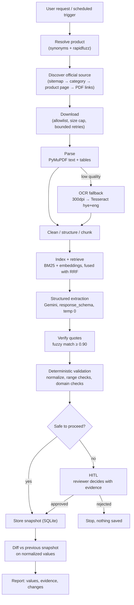

# Architecture

How the ACBA tariff monitoring agent is put together: the modules, the order they
run in, and the decisions behind them.

> **Current state: Phase 1 (contracts).** The package holds the vocabulary and the
> rules every later phase speaks — no fetching, parsing or model calls yet. Sections
> marked *(Phase N)* describe where each piece will be used.

---

## 1. The idea in one paragraph

A **tariff** is the bank's published price list for a product: currency, term, amount,
nominal rate, effective rate, collateral, fees, salary privileges. ACBA publishes these
in official documents («տեղեկատվական ամփոփագիր») and on product pages. This agent takes a
fuzzy product name in Armenian, English or Russian, finds the official source, extracts
those ten fields **with a quote and page for each**, validates them with plain Python,
stores a snapshot, compares it with the previous one, and reports what changed — handing
the decision to a human whenever it cannot decide safely.

## 2. End-to-end flow



**What Gemini decides:** which product the user meant (assisted by fuzzy matching), which
retrieved chunk answers a field, and what text to quote as evidence.

**What code decides — never the model:** which domains may be fetched, whether a download
is allowed by size and type, whether a quote really appears in the document, whether a
value is well-formed, what counts as a meaningful change, and whether a human is needed.

## 3. Module map (Phase 1)

```
config/                        version-controlled policy, readable without opening Python
  allowlist.yaml               the only fetchable hosts: acba.am, www.acba.am, https only
  products.yaml                the two products, hy/en/ru synonyms, seed URLs
src/tariff_agent/
  fields.py                    the tariff field registry — the spine of the project
  models.py                    Evidence / FieldValue / TariffExtraction + their invariants
  config.py                    env settings (SecretStr key) + typed YAML loaders
  errors.py                    one exception per failure mode
  observability/logging.py     single-line JSON logs with a per-run correlation id
tests/
  test_phase1_contracts.py     48 tests over the registry, config, invariants, migration
```

Dependencies form two short chains and no cycles:

```
fields.py ──► models.py        errors.py ──► config.py       observability/logging.py
(no imports)                   (no imports)                  (no imports)
                     └──────── models.py also imports errors + logging
```

The two modules everything imports — `fields.py` and `errors.py` — depend on nothing
themselves, so they cannot break from a change elsewhere.

### `fields.py` — the registry

Ten `FieldSpec` entries, each carrying everything the rest of the system needs to know
about that field:

| attribute | used by | what it does there |
|---|---|---|
| `id` | Phases 6–7 | key in the Gemini schema, the snapshot and the diff — never change it once snapshots exist |
| `label_hy` / `label_en` | report | what the business user reads |
| `kind` | Phase 6 | picks the normalizer: `"13,5 %"` → `{"value": 13.5, "unit": "percent"}` |
| `kind` | Phase 7 | picks the change magnitude rule: **percentage points** for rates, **relative %** for amounts |
| `required` | Phase 6 | a missing required field lowers the completeness score |
| `query_terms` | Phase 5 | the actual per-field retrieval queries, Armenian first |

Adding an eleventh tariff field is one entry here and nothing else. That property is the
justification for the module. Known limitation: `ValueKind` is coarse — `FEE` has to cover
`"0.5%"`, `"5,000 AMD"` and `"անվճար"`.

### `models.py` — the contracts, and the anti-hallucination rule

- **`Evidence`** — `document_name`, `source_url`, `page`, `section`, `quote`. Enough for a
  human to reopen the document and check the number. `page` is optional because HTML
  product pages have no pagination and are first-class sources here.
- **`FieldValue`** — `value` (verbatim from the document, or the `NOT_FOUND` sentinel),
  `normalized`, `evidence`, `status`, `confidence`.
  - `value` stays **verbatim** so the report shows what the bank actually wrote;
    `normalized` is the canonical form the diff compares, which is why
    `"10 000 000 AMD"` and `"10,000,000 AMD"` raise no false alert.
  - `NOT_FOUND` is a **string sentinel, not `None`**, so absence survives the trip through
    JSON, SQLite and the report, and cannot be confused with "not looked at yet".
  - `confidence` is `None` until Phase 6 computes it from the quote-match score, the
    document quality score and the retrieval score. It is **never** the model's own
    self-reported number — the Gemini response schema does not contain this field.
  - The validator enforces three rules: value and status must agree; a `NOT_FOUND` field
    carries no evidence or normalization; **a field holding a real value must have
    evidence**. The last one means a value that cannot cite a source cannot be
    constructed at all — hallucination is blocked structurally, not by prompt wording.
- **`FieldStatus`** — `found`, `not_found`, `unverified` (the quote could not be matched
  back to its chunk, or a check failed), `conflict` (two official sources disagree).
  Per-field trouble lives here; whether the *run* stops for a human is a separate,
  run-level decision carried by `NeedsReviewError`.
- **`TariffExtraction`** — one product, one run. The constructor requires **exactly** the
  registry's field ids: a dropped field is indistinguishable from a field the bank does
  not offer, and the report must tell those apart. The model cannot add fields of its own.
- **`TariffExtraction.from_stored()`** — the one lenient path. A snapshot written before a
  registry change would otherwise fail to load and crash the diff, so reading from storage
  backfills unknown-to-old fields as `NOT_FOUND`, drops fields no longer in the registry
  (with a log line), and preserves the stored `schema_version` (`0` for snapshots written
  before versioning). Fresh model output still goes through the strict constructor.

### `http/` — the one network door *(Phase 2)*

Everything downstream works on bytes this package has already declared safe. The LLM never
passes a URL in: agent tools take ids produced by earlier tools.

**`url_policy.py`** — pure functions, no I/O: `normalize_url`, `is_allowed_url`,
`assert_allowed`, `filter_allowed`. Exact host membership over https. Suffix matching
(`host.endswith(".acba.am")`) is the classic mistake — it accepts `acba.am.evil.com` — so it
is not used. Kept separate from the client so the rule is testable without HTTP machinery
and cheap to re-apply on every redirect hop.

**`client.py`** — `SafeHttpClient.fetch(url, expect=ContentKind.PDF)` applies, in order:
policy before the socket · separate connect/read timeouts · **manual redirect loop**, at
most 5 hops, allowlist re-checked on each (httpx's automatic redirects would follow a hop
off-domain silently) · streamed size cap on bytes actually received · content type checked
against both the header and the leading magic bytes · bounded exponential backoff with
jitter, only on timeouts, connection errors, 408/425/429/5xx · one JSON log line per fetch.

**Caching is revalidation, not a short-circuit.** A monitor that served cached bytes without
asking would never notice a new edition, so every fetch contacts the server with
`If-None-Match` / `If-Modified-Since` from the sidecar metadata; a `304` reuses the cached
bytes. Only `offline=true` skips the network. The validators are re-attached across a
redirect when — and only when — the target is exactly the `final_url` the cached copy came
from: ACBA permanently redirects `www.acba.am` → `acba.am`, and without this the ETag was
lost on every hop and the 1 MB tariff PDF was re-downloaded on every run.

**`robots.py`** — `RobotsPolicy` per host, fetched **through `SafeHttpClient` itself** (via
`check_robots=False`) so there is exactly one network door with one set of limits. A 4xx
means no rules exist and fetching proceeds; a 5xx or timeout means permission is unknown and
the run stops.

### `discovery/` — deciding what to download *(Phase 3)*

**`product_matcher.py`** — `resolve_product(query, catalog)` is hybrid and fully
deterministic: a curated multilingual synonym dictionary in `config/products.yaml` carries
the *semantics* (no string metric discovers that «հիփոթեք», "mortgage" and "ипотека" are one
product), rapidfuzz `token_set_ratio` absorbs the *typos, word order and extra words*, and an
`unsupported_terms` penalty handles the case similarity gets flat wrong — "business mortgage"
literally contains "mortgage" and scores 100 against it. Bands: ≥85 with a ≥10 lead resolves;
60–85 or a close race is `AMBIGUOUS` and goes to a human; below 60 is `NOT_FOUND`. It returns
a status object rather than raising, because the ambiguous case carries the data a reviewer
needs and Phase 8 tools must hand the model a status, never an exception.

**`sitemap.py`** — parsed with `defusedxml`, not lxml: stock XML parsers expand entities, and
a "billion laughs" document is a few hundred bytes on the wire and gigabytes in memory. Every
failure degrades to `[]`, because the sitemap is one route of three. ACBA's real sitemap
contains a malformed `<loc>`; one bad entry must not discard the other 587.

**`sources.py`** — `discover_product_sources()` returns a **primary source plus supporting
ones**, not a single winner. Two properties of the real site forced that shape:

* *The authoritative source is not always a PDF.* The consumer-loan page links no
  «ամփոփագիր» at all and states its rates inline, while the mortgage page links a proper
  information summary among nine PDFs. A "PDF beats HTML" rule reports the wrong document.
* *Some documents are shared.* `loans-tariffs.pdf` covers every loan product, so it is exempt
  from the product-slug requirement — and, being product-agnostic, it can never be primary.

Ranking is additive and **explainable**: every candidate carries the reasons behind its score
(`anchor mentions 'տեղեկատվական ամփոփագիր' (+50)`), which are logged and shown to a reviewer.
Weights live in `config/discovery.yaml` — Armenian keywords are exactly what a bank-side
reviewer should be able to correct. Negative weights matter as much as positive ones: an
archived tariff PDF and a business-product page are the two ways a plausible-looking document
is the wrong one, and `/business/` vs `/individual/` in the path is a stronger discriminator
than any keyword. Candidates below `min_score` are dropped, not merely ranked last.

Selection order is **role first, then score**: only a candidate carrying a primary signal (an
information summary, or a page that states rates itself) may lead. Supporting sources are then
ranked by score alone, so the shared tariff PDF is not buried beneath sibling pages.

When two *information summaries* score within 10 points — ACBA publishes separate ones for
purchase and renovation mortgages — `requires_review` is set with both candidates. That is the
assignment's "two plausible official PDFs" HITL case, produced by the real site rather than
staged.

### `config.py` — split by who needs to audit it

- **Secrets → environment.** `Settings` (pydantic-settings) reads `.env`. App variables use
  the `TARIFF_` prefix; `GOOGLE_API_KEY` and `GOOGLE_GENAI_USE_VERTEXAI` stay unprefixed
  because the google-genai SDK reads those exact names itself. The key is a `SecretStr`, so
  it is masked in reprs, logs and tracebacks. `has_api_key` lets offline demos and tests
  take the mock path instead of failing.
- **Policy → committed YAML.** `Allowlist` and `ProductCatalog` are frozen models parsed
  from `config/*.yaml`, so a reviewer sees the project's whole network surface in six lines
  and product changes show up in a diff. `Allowlist` is data only — matching logic belongs
  to the Phase 2 URL policy, which must run on **every redirect hop**.
- A missing or malformed file raises `ConfigError` naming the file at startup, rather than
  misbehaving halfway through a run.

### `errors.py` — named failure modes

One class per failure mode under `TariffAgentError`, so callers branch on type instead of
string-matching English: `ConfigError`, `FetchError`, `DomainNotAllowedError`,
`DocumentError`, `ProductNotFoundError`, `SourceNotFoundError`, `ExtractionError`,
`ValidationFailedError`, `SnapshotError`, `ReviewRejectedError`.

`NeedsReviewError(reason, details)` is different in kind: not a bug, but the pipeline
correctly refusing to decide alone (two plausible PDFs, a 12.5% → 18% jump, unreadable
OCR). `reason` is machine-readable; `details` carries the evidence the reviewer needs.

*(Phase 8)* Tool wrappers turn these into `{"status": "error", "error_type": ..., "message": ...}`
results, so the model sees a controlled failure — never a traceback, never fabricated data
standing in for a failure.

### `observability/logging.py` — the audit trail

Single-line JSON: `ts`, `level`, `logger`, `event`, `run_id`, plus anything passed as
`extra={...}` lifted to a top-level key. Machine-readable on purpose — Phase 9 computes
tool-failure rate, extraction completeness and HITL rate from these lines without parsing
English. The `run_id` lives in a `ContextVar` so it does not have to be threaded through
every function signature. Armenian text is written unescaped. **Chain-of-thought is never
logged** — decisions and their inputs and outputs only.

## 4. Design decisions

| # | Decision | Alternative rejected | Why |
|---|---|---|---|
| D1 | One field registry | Declare fields per stage | Four copies of the same list drift; adding a field must touch one file |
| D2 | Invariants in validators | Rely on prompt instructions | Prompt wording drifts between model versions; a validator does not |
| D3 | `NOT_FOUND` string sentinel | `None` | Survives JSON → SQLite → report; `None` is ambiguous |
| D4 | Keep `value` verbatim **and** `normalized` | Store only the normalized form | The report must show the bank's own wording; the diff needs a canonical form |
| D5 | Strict registry coverage on fresh extractions | Accept partial output | "Dropped by a bug" and "not offered by the bank" must look different |
| D6 | Lenient `from_stored()` + `schema_version` | One strict path for everything | Otherwise adding a field breaks every stored snapshot and crashes the diff |
| D7 | Per-field `unverified`/`conflict`; run-level `NeedsReviewError` | A `needs_review` field status | "Stop and ask a human" is a property of the run, not of one value |
| D8 | `confidence` computed deterministically, `None` until then | The model's self-reported confidence | LLM confidence is not calibrated; a fake 1.0 is worse than an honest blank |
| D9 | Policy in YAML, secrets in env | Everything in one place | The network surface must be reviewable; secrets must not be committed |
| D10 | Exact hosts, no wildcard subdomains | `*.acba.am` | A hijacked or user-content subdomain would be reachable |
| D11 | Google env vars unprefixed | Rename to `TARIFF_*` | The SDK reads those exact names; renaming buys nothing and breaks the SDK |
| D12 | Exception per failure mode | One error class + message text | Retry logic must branch on type, not on English strings |
| D13 | JSON logs + `ContextVar` run id | Plain logs, pass `run_id` around | Metrics must be computable; signatures stay clean |
| D14 | `Allowlist` is data, no methods | Give it an `is_allowed()` | Matching must run per redirect hop — that is the HTTP layer's job |
| D15 | Python 3.11 | System Python 3.14 | No reliable PyMuPDF / google-adk wheels on 3.14 yet |
| D16 | Manual redirect loop | `follow_redirects=True` | Automatic redirects would leave the bank's domain without ever telling us |
| D17 | robots.txt: 4xx allows, 5xx stops | Blanket fail-open or fail-closed | Fail-open ignores a real signal; fail-closed makes the agent hostage to one file |
| D18 | Cache revalidates every run | Serve cached bytes when present | A monitor that never asks the server cannot detect a change |
| D19 | `sleep` and `transport` injected | Patch `time.sleep` in tests | Explicit seams keep the retry tests instant and honest |
| D20 | 403 never retried | Retry all failures | An access decision is respected, not hammered |
| D21 | mypy strict on `src` only | Strict everywhere | Tests pass plain strings where pydantic coerces them — that is the behaviour under test, not a type error |
| D22 | Deterministic product resolution | Ask Gemini which product was meant | A wrong resolution silently reports another product's tariffs; this decision must be reproducible offline and explainable in one log line |
| D23 | Synonym dictionary + fuzzy + penalty | Fuzzy matching alone | "business mortgage" contains "mortgage" and scores 100 — similarity alone cannot represent "we do not monitor that" |
| D24 | Resolution returns a status, never raises | Raise `ProductNotFoundError` | The ambiguous case is data for a reviewer, and agent tools must not raise into the model |
| D25 | Primary + supporting sources | A single best source | The consumer-loan page holds its own rates while the shared tariff PDF outscores it; both are needed |
| D26 | Role before score when choosing the primary | Rank by score alone | A document covering every loan product is never one product's authoritative source, however well it scores |
| D27 | Scoring weights in YAML | Constants in Python | The Armenian keywords are policy a bank-side reviewer should be able to read and correct |
| D28 | `defusedxml` for the sitemap | `lxml` / stdlib ElementTree | Entity expansion turns a few hundred bytes into gigabytes of memory |
| D29 | Two close summaries → review | Pick the higher score | Purchase vs renovation mortgage is a coin flip on which product's rates get reported |

## 5. Test strategy

Coverage is deliberately deep on the **invariants** (the rules that stop bad data reaching
a report) and lighter on plumbing:

| area | tests | what they defend |
|---|---|---|
| Field registry | 6 + 10 parametrized | the ten fields, unique ids, immutability, correct `kind` per field |
| Config | 8 | https-only allowlist, both products, hy/en/ru synonyms, **every seed URL on the allowlist**, `ConfigError` on bad input |
| Model invariants | 11 | every illegal combination of value / status / evidence is rejected |
| Snapshot migration | 6 | backfill, drop, version 0, corrupt payload, and that the strict path stays strict |
| Settings | 3 | prefixed and unprefixed vars, key never printed, no-key mode works |
| Logging | 4 | run-id binding, structured extras, idempotent setup, Armenian round-trip |
| URL policy | 19 | lookalike hosts, plain http, ports, relative resolution, percent-encoding |
| HTTP client | 25 | 404/403 not retried, 5xx retried then succeeds, capped `Retry-After`, oversize aborted, mislabelled content rejected, off-domain redirect refused, 304 revalidation, offline mode |
| robots.txt | 5 | disallowed path refused, 404 allows, 5xx stops the run, fetched once per host |
| Product matching | 31 | hy/en/ru + transliterations, typos, «loan» ambiguity, business products refused, nonsense refused, NFC equivalence, determinism |
| Discovery | 26 | sitemap traps and XML bombs, page-selection floors, keyword and path scoring, primary/supporting split, HITL on rival summaries, crawl budget, seed fallback, broken page mid-crawl |

*(Phase 9)* adds an evaluation dataset measuring product-resolution accuracy, retrieval hit
rate, field match, NOT_FOUND precision and evidence-verification rate.

## 6. Roadmap

| Phase | Contents | Status |
|---|---|---|
| 1 | Skeleton, config, field registry, models, errors, logging | ✅ |
| 1.5 | Schema versioning, status rework, deterministic confidence, docs | ✅ |
| 2 | Safe HTTP client: allowlist per redirect hop, size/MIME caps, bounded retries | ✅ |
| 3 | Product resolution + official source discovery | ✅ |
| 4 | PDF/HTML processing, cleaning, OCR fallback | next |
| 5 | Chunking + hybrid BM25/embedding RAG | |
| 6 | Gemini structured extraction + deterministic validation | |
| 7 | Snapshots, normalized diffing, human-in-the-loop | |
| 8 | ADK agent, pipeline, CLI | |
| 9 | Demos, evaluation dataset, remaining docs | |
